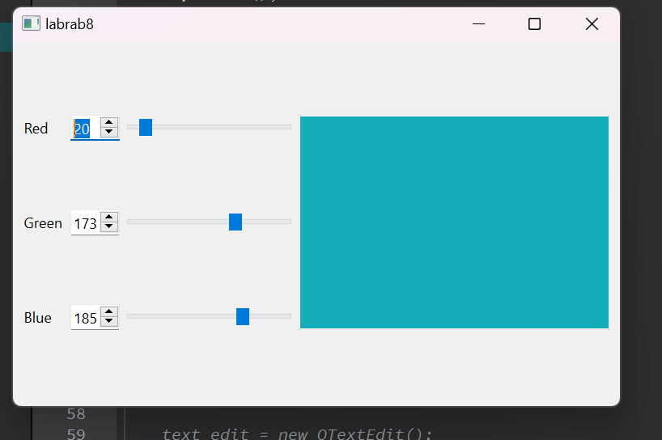
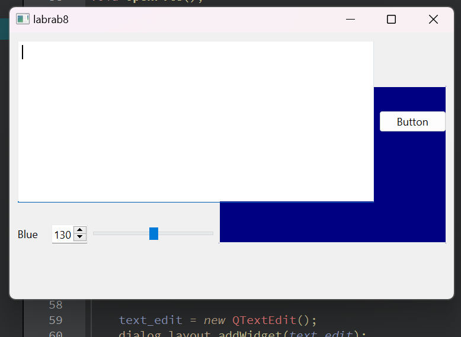
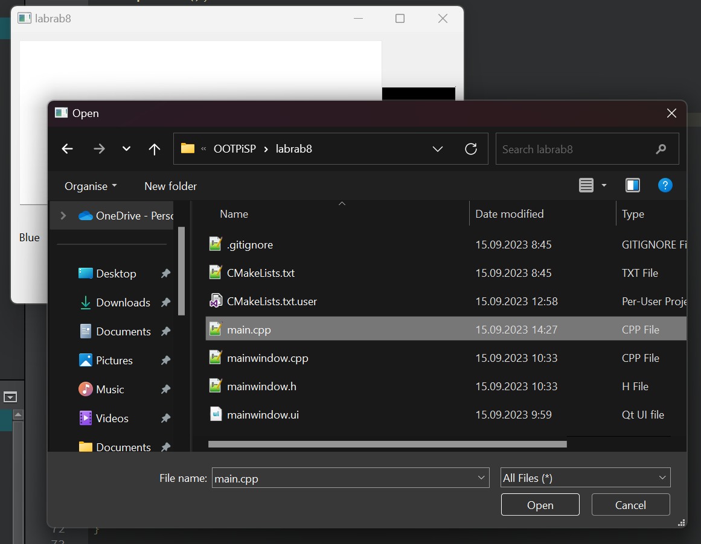
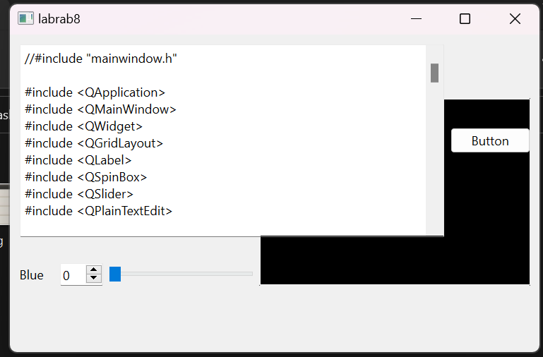

# Отчет по лабораторной работе №1

## Использование библиотеки элементов графического интерфейса Qt

## Вариант №15

`Мисиюк Алексей Сергеевич (ПО-9)`

## Цель лабораторной работы

Научиться использовать библиотеку элементов графического интерфейса Qt.

## Задание *(4 балла)*

* пользуясь примером в каталоге lab08/02, создайте приложение с графическим интерфейсом, аналогичным представленному ---сверху---

* используйте классы QLabel, QSpinBox, QSlider, QPlainTextEdit.


## Знакомство с элементами интерфейса: добавим функциональность. *(3 балла)*

* Добавим функциональность созданному на предыдущем этапе приложению:

  * спин-боксы и слайдеры будут перемещаться синхронизировано в диапазоне значений от 0 до 255.

  * Цвет фона QPlainTextEdit будет меняться соответственно

* Выполнение:

  * Выставляем диапазон допустимых значений для QSpinBox и QSlider при помощи методов setMinimum() и setMaximum()

  * запрещаем ввод в текстовое поле: setEnabled(false)

  * Реализуем метод setColor() и слоты setRed(int), setGreen(int), setBlue(int)

  * к слотам подключаем сигналы QSlider::sliderMoved() и QSpinBox::valueChanged()

  * в реализации слотов синхронизируем значения слайдера и спин-бокса и вызываем setColor()

* Для изменения цвета фона текстового поля воспользуемся таблицами стилей для описания стиля элементов.

  * таблицы стилей используют синтаксис CSS

  * будем задавать цвет в виде строки типа #rrggbb

  * таким образом, надо задать QPlainTextEdit следующий стиль:

  * QPlainTextEdit { background: #rrggbb; }

  * задаём стиль при помощи метода setStyleSheet() (таблица стиля передаётся в виде строки).

## Диалоги *(3 балла)*

Библиотека графических элементов Qt предлагает набор из нескольких полнофункциональных диалоговых окон, позволяющих выполнять некоторые стандартные операции. Среди них такие, как выбор файла в файловой системе, выбор шрифта, выбор цвета, диалог печати и некоторые другие. Мы рассмотрим в настоящей работе пример использования диалога выбора файла - QFileDialog.

**Создаём простейший обозреватель текстовых файлов.**

* Создайте новый виджет и поместите на него элемент QTextEdit.

* Добавьте кнопку QPushButton и подключите её сигнал clicked() к слоту openFile()

* Реализуйте в слоте выбор имени файла пользователем: QFileDialog::getOpenFileName()

* Откройте QFile в соответствии с выбранным названием

* Прочитайте его содержимое и поместите в виде текста в элемент QTextEdit

## Код программы

Проект можно найти здесь: *<https://github.com/11ALX11/OOTPiSP/tree/master/labrab8>*

main.cpp:

```c++

//#include "mainwindow.h"

#include <QApplication>
#include <QMainWindow>
#include <QWidget>
#include <QGridLayout>
#include <QLabel>
#include <QSpinBox>
#include <QSlider>
#include <QPlainTextEdit>

#include <QHBoxLayout>
#include <QPushButton>
#include <QFileDialog>
#include <QFile>

QPlainTextEdit* pte;
int pte_red = 0;
int pte_green = 0;
int pte_blue = 0;

QSpinBox* sp_red;
QSpinBox* sp_green;
QSpinBox* sp_blue;
QSlider* s_red;
QSlider* s_green;
QSlider* s_blue;

QTextEdit *text_edit;

void populate_window(QWidget* widget);
void setColor();

void setRed(int color);
void setGreen(int color);
void setBlue(int color);

void openFile();

int main(int argc, char *argv[])
{
    QApplication a(argc, argv);
//    MainWindow w(0);
    QMainWindow w(0);

    QWidget *centralWidget = new QWidget(&w);
    w.setCentralWidget(centralWidget);

    populate_window(centralWidget);

    // ---------------------------------------

    QWidget *dialog_widget = new QWidget(&w);
    dialog_widget->resize(500, 200);

    QHBoxLayout dialog_layout;
    dialog_widget->setLayout(&dialog_layout);

    text_edit = new QTextEdit();
    dialog_layout.addWidget(text_edit);

    QPushButton *btn = new QPushButton();
    dialog_widget->connect(btn, &QPushButton::clicked, dialog_widget, openFile);
    btn->setText("Button");
    dialog_layout.addWidget(btn);

    // ---------------------------------------

    w.show();
    w.resize(500, 300);
    return a.exec();
}

void populate_window(QWidget* widget) {
    QGridLayout *grid_layout = new QGridLayout(widget);

    QLabel *l_red = new QLabel("Red");
    QLabel *l_green = new QLabel("Green");
    QLabel *l_blue = new QLabel("Blue");
    grid_layout->addWidget(l_red, 0, 0);
    grid_layout->addWidget(l_green, 1, 0);
    grid_layout->addWidget(l_blue, 2, 0);

    sp_red = new QSpinBox();
    sp_green = new QSpinBox();
    sp_blue = new QSpinBox();
    widget->connect(sp_red, &QSpinBox::valueChanged, widget, setRed);
    widget->connect(sp_green, &QSpinBox::valueChanged, widget, setGreen);
    widget->connect(sp_blue, &QSpinBox::valueChanged, widget, setBlue);
    sp_red->setMaximum(255);
    sp_green->setMaximum(255);
    sp_blue->setMaximum(255);
    grid_layout->addWidget(sp_red, 0, 1);
    grid_layout->addWidget(sp_green, 1, 1);
    grid_layout->addWidget(sp_blue, 2, 1);

    s_red = new QSlider(Qt::Orientation::Horizontal);
    s_green = new QSlider(Qt::Orientation::Horizontal);
    s_blue = new QSlider(Qt::Orientation::Horizontal);
    widget->connect(s_red, &QSlider::valueChanged, widget, setRed);
    widget->connect(s_green, &QSlider::valueChanged, widget, setGreen);
    widget->connect(s_blue, &QSlider::valueChanged, widget, setBlue);
    s_red->setMaximum(255);
    s_green->setMaximum(255);
    s_blue->setMaximum(255);
    grid_layout->addWidget(s_red, 0, 2);
    grid_layout->addWidget(s_green, 1, 2);
    grid_layout->addWidget(s_blue, 2, 2);

    pte = new QPlainTextEdit();
    setColor();
    pte->setEnabled(false);
    grid_layout->addWidget(pte, 0, 3, 0, 2);
}

void setColor() {
    const QString templ("background-color: rgb(%1, %2, %3);");
    pte->setStyleSheet(templ.arg(pte_red).arg(pte_green).arg(pte_blue));
}

void setRed(int color) {
    pte_red = color;
    sp_red->setValue(color);
    s_red->setValue(color);
    setColor();
}
void setGreen(int color) {
    pte_green = color;
    sp_green->setValue(color);
    s_green->setValue(color);
    setColor();
}
void setBlue(int color) {
    pte_blue = color;
    sp_blue->setValue(color);
    s_blue->setValue(color);
    setColor();
}

void openFile() {
    QString file_name = QFileDialog::getOpenFileName();
    QFile file(file_name);
    file.open(QFile::OpenModeFlag::ReadOnly);

    QByteArray file_content = file.readAll();
    text_edit->setText(file_content);
}

```

## Пример работы программы

1. Окно выбора цвета
   

2. Окно выбора цвета И выбор файла
   

3. Выбор файла
   

4. п.2 вместе с содержимым файла
   
